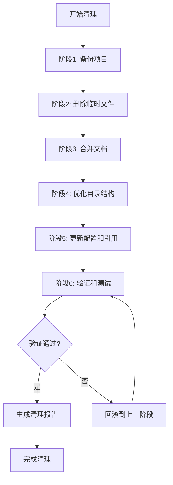

# 项目清理设计文档

**作者**: RJ.Wang  
**邮箱**: wangrenjun@gmail.com  
**创建时间**: 2025-11-16  
**项目**: EKS Info WebApp - 项目清理与优化

---

## 概述

本设计文档描述了如何实现项目清理和优化的技术方案。清理过程分为 6 个阶段，采用渐进式方法，确保每个阶段完成后项目仍然可用。

### 设计目标

1. **安全性**: 确保不删除核心文件，保留项目可运行性
2. **可追溯性**: 每个阶段独立提交，便于回滚
3. **完整性**: 更新所有文件引用，保持文档准确性
4. **专业性**: 优化项目结构，符合行业最佳实践

---

## 架构设计

### 清理流程架构



### 目标目录结构

```
terraform-eks-webdemo/
├── .git/                        # Git 仓库
├── .gitignore                   # 更新的忽略规则
├── .kiro/                       # Kiro 配置
│   └── specs/
│       ├── eks-info-webapp/     # 原有 spec
│       └── project-cleanup/     # 清理 spec
│
├── README.md                    # 主文档（更新）
├── DEPLOYMENT.md                # 部署文档（合并）
├── API_DOCUMENTATION.md         # API 文档（合并）
├── PROJECT_SUMMARY.md           # 项目总结（合并）
├── BUGFIX_REPORT.md             # Bug 修复报告（合并）
├── TROUBLESHOOTING.md           # 故障排除（保留）
│
├── terraform/                   # Terraform 代码
│   ├── main.tf
│   ├── app.tf
│   ├── variables.tf
│   ├── outputs.tf
│   ├── versions.tf
│   ├── terraform.tfvars
│   └── .terraform.lock.hcl
│
├── scripts/                     # 工具脚本
│   ├── build.sh
│   ├── deploy.sh
│   ├── get-alb-hostname.sh
│   ├── test_all_pages.sh
│   ├── verify_environment_info.sh
│   └── verify_frontend.sh
│
├── k8s/                         # Kubernetes 配置
│   ├── README.md
│   ├── namespace.yaml
│   ├── serviceaccount.yaml
│   ├── deployment.yaml
│   ├── service.yaml
│   ├── ingress.yaml
│   ├── hpa.yaml
│   └── storage/
│       ├── storageclass-ebs.yaml
│       ├── storageclass-efs.yaml
│       ├── pvc-ebs.yaml
│       └── pvc-efs.yaml
│
└── eks-info-app/                # 应用代码
    ├── app.py
    ├── config.py
    ├── main.py
    ├── requirements.txt
    ├── Dockerfile
    ├── README.md
    ├── API_DOCUMENTATION.md     # 合并的 API 文档
    ├── DOCKER_BUILD_GUIDE.md
    ├── build.sh
    ├── push-to-ecr.sh
    ├── routes/
    ├── services/
    ├── storage/
    ├── templates/
    ├── static/
    └── tests/                   # 测试文件
        ├── __init__.py
        ├── test_*.py
        └── conftest.py
```

---

## 组件设计

### 1. 备份组件

#### 功能
创建项目完整备份，确保清理过程可以回滚。

#### 实现方式
```bash
# 创建带时间戳的备份
tar -czf project-backup-$(date +%Y%m%d-%H%M%S).tar.gz \
  --exclude='.git' \
  --exclude='node_modules' \
  --exclude='.venv' \
  --exclude='__pycache__' \
  .
```

#### 备份内容
- 所有源代码文件
- 所有配置文件
- 所有文档文件
- Terraform 状态文件

#### 排除内容
- .git 目录（已有版本控制）
- Python 虚拟环境
- Node modules
- 缓存目录

---

### 2. 临时文件清理组件

#### 2.1 日志文件清理

**目标文件**:
- `deployment.log`
- `terraform-apply.log`
- `terraform-apply-final.log`
- 所有 `*.log` 文件

**实现**:
```bash
# 删除根目录日志
rm -f deployment.log terraform-apply*.log

# 查找并删除所有日志文件（排除 .git）
find . -name "*.log" -not -path "./.git/*" -delete
```

#### 2.2 Terraform 临时文件清理

**目标文件**:
- `tfplan`
- `tfplan.*`

**保留文件**:
- `terraform.tfstate`
- `terraform.tfstate.backup`
- `.terraform.lock.hcl`

**实现**:
```bash
rm -f tfplan tfplan.*
```

#### 2.3 系统文件清理

**目标文件**:
- `.DS_Store` (macOS)
- `Thumbs.db` (Windows)
- `._*` (macOS 资源分支)

**实现**:
```bash
find . -name ".DS_Store" -delete
find . -name "Thumbs.db" -delete
find . -name "._*" -delete
```

#### 2.4 Python 缓存清理

**目标目录**:
- `__pycache__/`
- `.pytest_cache/`
- `*.pyc`, `*.pyo`, `*.pyd`

**实现**:
```bash
find . -type d -name "__pycache__" -exec rm -rf {} +
find . -type d -name ".pytest_cache" -exec rm -rf {} +
find . -name "*.pyc" -delete
find . -name "*.pyo" -delete
find . -name "*.pyd" -delete
```

---

### 3. 脚本清理组件

#### 3.1 修复脚本删除

**目标文件**:
- `fix_all_routes.sh`
- `fix_routes_accept_header.py`
- `fix_routes_indentation.py`
- `fix_routes_logic.py`
- `fix_routes_properly.py`
- `redeploy_fixed_app.sh`
- `final_deploy.sh`

**实现**:
```bash
rm -f fix_*.sh fix_*.py redeploy_*.sh final_deploy.sh
```

#### 3.2 临时测试文件删除

**目标文件**:
- `test-deployment.yaml`

**实现**:
```bash
rm -f test-deployment.yaml
```

---

### 4. 文档合并组件

#### 4.1 Bug 修复文档合并

**源文件**:
1. `BUGFIX_SUMMARY.md`
2. `BUGFIX_VERIFICATION_REPORT.md`
3. `BUGFIX_FINAL_REPORT.md`

**目标文件**: `BUGFIX_REPORT.md`

**合并结构**:
```markdown
# Bug 修复报告

## 概述
[来自 BUGFIX_SUMMARY.md]

## 问题描述
[来自 BUGFIX_SUMMARY.md]

## 修复方案
[来自 BUGFIX_SUMMARY.md]

## 验证报告
[来自 BUGFIX_VERIFICATION_REPORT.md]

## 最终报告
[来自 BUGFIX_FINAL_REPORT.md]

## 总结
[综合所有文档]
```

#### 4.2 项目总结文档合并

**源文件**:
1. `TASK_5_SUMMARY.md`
2. `TASK_7_SUMMARY.md`
3. `TASK_8_SUMMARY.md`
4. `TASK_19_3_VERIFICATION.md`
5. `TASK_19_4_VERIFICATION.md`
6. `PROJECT_COMPLETION_SUMMARY.md`

**目标文件**: `PROJECT_SUMMARY.md`

**合并结构**:
```markdown
# 项目开发总结

## 项目概述
[来自 PROJECT_COMPLETION_SUMMARY.md]

## 任务完成情况

### 任务 5: [标题]
[来自 TASK_5_SUMMARY.md]

### 任务 7: [标题]
[来自 TASK_7_SUMMARY.md]

### 任务 8: [标题]
[来自 TASK_8_SUMMARY.md]

## 验证报告

### 任务 19.3 验证
[来自 TASK_19_3_VERIFICATION.md]

### 任务 19.4 验证
[来自 TASK_19_4_VERIFICATION.md]

## 项目完成总结
[来自 PROJECT_COMPLETION_SUMMARY.md]
```

#### 4.3 部署文档合并

**源文件**:
1. `DEPLOYMENT_STATUS.md`
2. `TERRAFORM_DEPLOYMENT.md`

**目标文件**: `DEPLOYMENT.md`

**合并结构**:
```markdown
# 部署指南

## 快速开始
[来自 README.md 的部署部分]

## Terraform 部署详解
[来自 TERRAFORM_DEPLOYMENT.md]

## 部署状态和验证
[来自 DEPLOYMENT_STATUS.md]

## 故障排除
[链接到 TROUBLESHOOTING.md]
```

#### 4.4 API 文档合并

**源文件** (eks-info-app 目录):
1. `EBS_API_USAGE.md`
2. `EFS_API_USAGE.md`
3. `S3_API_USAGE.md`
4. `NETWORK_API_USAGE.md`
5. `RESOURCES_API_USAGE.md`
6. `SCALING_API_USAGE.md`
7. `STORAGE_API_USAGE.md`
8. `STRESS_API_USAGE.md`

**目标文件**: `eks-info-app/API_DOCUMENTATION.md`

**合并结构**:
```markdown
# API 文档

## 概述

## 存储 API

### EBS API
[来自 EBS_API_USAGE.md]

### EFS API
[来自 EFS_API_USAGE.md]

### S3 API
[来自 S3_API_USAGE.md]

### 存储概览 API
[来自 STORAGE_API_USAGE.md]

## 功能 API

### 网络 API
[来自 NETWORK_API_USAGE.md]

### 资源 API
[来自 RESOURCES_API_USAGE.md]

### 扩展 API
[来自 SCALING_API_USAGE.md]

### 压力测试 API
[来自 STRESS_API_USAGE.md]

## API 使用示例

## 错误处理
```

---

### 5. 目录结构优化组件

#### 5.1 Terraform 目录创建

**操作**:
```bash
# 创建目录
mkdir -p terraform

# 移动文件
mv main.tf terraform/
mv app.tf terraform/
mv variables.tf terraform/
mv outputs.tf terraform/
mv versions.tf terraform/
mv terraform.tfvars terraform/
mv .terraform.lock.hcl terraform/

# 移动 Terraform 工作目录
mv .terraform terraform/
```

**更新引用**:
- `deploy.sh`: 更新 terraform 命令的工作目录
- `README.md`: 更新文件路径说明

#### 5.2 Scripts 目录创建

**操作**:
```bash
# 创建目录
mkdir -p scripts

# 移动文件
mv build.sh scripts/
mv deploy.sh scripts/
mv get-alb-hostname.sh scripts/
mv test_all_pages.sh scripts/
mv verify_environment_info.sh scripts/
mv verify_frontend.sh scripts/
```

**更新引用**:
- `README.md`: 更新脚本路径
- 所有脚本内部的相对路径引用

#### 5.3 Tests 目录创建

**操作**:
```bash
# 创建目录
mkdir -p eks-info-app/tests

# 移动文件
cd eks-info-app
mv test_*.py tests/

# 创建 __init__.py
touch tests/__init__.py

# 创建 conftest.py（如果需要）
cat > tests/conftest.py << 'EOF'
"""
测试配置文件

作者: RJ.Wang
邮箱: wangrenjun@gmail.com
"""
import sys
from pathlib import Path

# 添加父目录到 Python 路径
sys.path.insert(0, str(Path(__file__).parent.parent))
EOF
```

**更新引用**:
- 测试文件中的导入路径
- pytest 配置（如果有）

#### 5.4 K8s Storage 目录创建

**操作**:
```bash
# 创建目录
mkdir -p k8s/storage

# 移动文件
cd k8s
mv storageclass-*.yaml storage/
mv pvc-*.yaml storage/
```

**更新引用**:
- `deploy.sh`: 更新 kubectl apply 路径
- `k8s/README.md`: 更新文件路径说明

---

### 6. 配置更新组件

#### 6.1 .gitignore 更新

**添加内容**:
```gitignore
# 日志文件
*.log
deployment.log
terraform-apply*.log

# Terraform
*.tfstate
*.tfstate.*
.terraform/
tfplan
tfplan.*

# Python
__pycache__/
*.py[cod]
*$py.class
.pytest_cache/
.venv/
venv/
*.egg-info/
dist/
build/

# IDE
.vscode/
.idea/
*.swp
*.swo
*~

# OS
.DS_Store
._*
Thumbs.db
ehthumbs.db

# 临时文件
*.tmp
*.bak
*.backup

# 备份文件
project-backup-*.tar.gz
```

#### 6.2 README.md 更新

**更新内容**:
1. 项目结构图
2. 脚本路径引用
3. 文档链接
4. 快速开始命令

**示例**:
```markdown
## 快速开始

### 步骤 1: 构建镜像
```bash
./scripts/build.sh
```

### 步骤 2: 部署
```bash
./scripts/deploy.sh
```

## 文件结构
[更新为新的目录结构]

## 相关文档
- [部署指南](DEPLOYMENT.md)
- [API 文档](eks-info-app/API_DOCUMENTATION.md)
- [项目总结](PROJECT_SUMMARY.md)
- [故障排除](TROUBLESHOOTING.md)
```

#### 6.3 脚本路径更新

**deploy.sh 更新**:
```bash
# 原路径
terraform init
terraform apply

# 新路径
cd terraform
terraform init
terraform apply
cd ..
```

**build.sh 更新**:
```bash
# 原路径
cd eks-info-app

# 新路径（如果从 scripts 目录调用）
cd ../eks-info-app
```

---

### 7. 验证组件

#### 7.1 Terraform 验证

**验证步骤**:
```bash
cd terraform
terraform init
terraform validate
terraform fmt -check
cd ..
```

**验证内容**:
- Terraform 配置语法正确
- 所有模块可以初始化
- 格式符合规范

#### 7.2 Docker 构建验证

**验证步骤**:
```bash
cd eks-info-app
docker build -t eks-info-app:test .
cd ..
```

**验证内容**:
- Dockerfile 语法正确
- 所有依赖可以安装
- 镜像可以成功构建

#### 7.3 Python 测试验证

**验证步骤**:
```bash
cd eks-info-app
python -m pytest tests/ -v
cd ..
```

**验证内容**:
- 所有测试可以发现
- 导入路径正确
- 测试可以执行

#### 7.4 脚本可执行性验证

**验证步骤**:
```bash
# 检查脚本权限
ls -l scripts/*.sh

# 测试脚本帮助
scripts/build.sh --help
scripts/deploy.sh help
```

**验证内容**:
- 所有脚本有执行权限
- 脚本可以正常运行
- 帮助信息正确显示

#### 7.5 文档链接验证

**验证方法**:
- 手动检查所有 Markdown 文件中的链接
- 验证相对路径正确
- 确认引用的文件存在

---

## 数据模型

### 文件分类模型

```typescript
interface FileCategory {
  name: string;
  pattern: string[];
  action: 'delete' | 'move' | 'merge' | 'keep';
  priority: 'high' | 'medium' | 'low';
}

const fileCategories: FileCategory[] = [
  {
    name: '临时日志',
    pattern: ['*.log', 'deployment.log', 'terraform-apply*.log'],
    action: 'delete',
    priority: 'high'
  },
  {
    name: 'Terraform 临时文件',
    pattern: ['tfplan', 'tfplan.*'],
    action: 'delete',
    priority: 'high'
  },
  {
    name: '系统文件',
    pattern: ['.DS_Store', 'Thumbs.db', '._*'],
    action: 'delete',
    priority: 'high'
  },
  {
    name: '修复脚本',
    pattern: ['fix_*.sh', 'fix_*.py', 'redeploy_*.sh'],
    action: 'delete',
    priority: 'medium'
  },
  {
    name: 'Bug 修复文档',
    pattern: ['BUGFIX_*.md'],
    action: 'merge',
    priority: 'medium'
  },
  {
    name: '任务总结文档',
    pattern: ['TASK_*.md', 'PROJECT_COMPLETION_SUMMARY.md'],
    action: 'merge',
    priority: 'medium'
  },
  {
    name: 'API 文档',
    pattern: ['*_API_USAGE.md'],
    action: 'merge',
    priority: 'low'
  },
  {
    name: 'Terraform 文件',
    pattern: ['*.tf', 'terraform.tfvars', '.terraform.lock.hcl'],
    action: 'move',
    priority: 'high'
  },
  {
    name: '脚本文件',
    pattern: ['*.sh'],
    action: 'move',
    priority: 'medium'
  },
  {
    name: '测试文件',
    pattern: ['test_*.py'],
    action: 'move',
    priority: 'medium'
  }
];
```

### 清理状态模型

```typescript
interface CleanupStatus {
  phase: string;
  status: 'pending' | 'in_progress' | 'completed' | 'failed';
  filesProcessed: number;
  filesTotal: number;
  errors: string[];
  startTime: Date;
  endTime?: Date;
}

interface CleanupReport {
  projectName: string;
  cleanupDate: Date;
  phases: CleanupStatus[];
  summary: {
    filesDeleted: number;
    filesMoved: number;
    filesMerged: number;
    directoriesCreated: number;
    totalTime: number;
  };
}
```

---

## 错误处理

### 错误类型

1. **文件不存在错误**
   - 场景: 尝试删除或移动不存在的文件
   - 处理: 记录警告，继续执行

2. **权限错误**
   - 场景: 没有权限删除或移动文件
   - 处理: 记录错误，跳过该文件

3. **路径引用错误**
   - 场景: 更新后的路径引用不正确
   - 处理: 回滚到上一阶段，修复引用

4. **验证失败错误**
   - 场景: Terraform 或 Docker 验证失败
   - 处理: 停止清理，报告错误

### 错误恢复策略

```bash
# 每个阶段执行前创建检查点
git add .
git commit -m "清理阶段 X 开始"

# 如果出错，回滚到上一个检查点
git reset --hard HEAD~1

# 查看错误日志
cat cleanup-error.log
```

---

## 测试策略

### 单元测试

**测试内容**:
- 文件删除函数
- 文件移动函数
- 文档合并函数
- 路径更新函数

**测试方法**:
- 创建临时测试目录
- 执行清理操作
- 验证结果
- 清理测试环境

### 集成测试

**测试内容**:
- 完整清理流程
- Terraform 初始化和验证
- Docker 镜像构建
- Python 测试执行

**测试方法**:
- 在测试分支执行完整清理
- 验证所有功能正常
- 合并到主分支

### 验收测试

**测试内容**:
- 项目可以正常构建
- 项目可以正常部署
- 所有文档链接有效
- 目录结构符合设计

**测试方法**:
- 执行完整的构建和部署流程
- 手动检查所有文档
- 验证目录结构

---

## 性能考虑

### 清理性能

- **预计时间**: 3-5 分钟
- **瓶颈**: 文档合并（需要读取和写入多个文件）
- **优化**: 并行处理独立的清理任务

### 验证性能

- **预计时间**: 5-10 分钟
- **瓶颈**: Docker 镜像构建
- **优化**: 使用缓存加速构建

---

## 安全考虑

### 数据安全

1. **备份**: 清理前创建完整备份
2. **版本控制**: 每个阶段独立提交
3. **核心文件保护**: 不删除 Terraform 状态文件

### 操作安全

1. **权限检查**: 确保有足够权限执行操作
2. **路径验证**: 避免删除错误的文件
3. **确认机制**: 重要操作前要求用户确认

---

## 部署考虑

### 清理执行环境

- **操作系统**: macOS/Linux
- **必需工具**: bash, find, tar, git
- **可选工具**: docker, terraform, kubectl

### 清理执行顺序

1. 在本地开发环境执行
2. 验证清理结果
3. 提交到版本控制
4. 推送到远程仓库

---

## 监控和日志

### 日志记录

**日志文件**: `cleanup-execution.log`

**日志内容**:
- 每个阶段的开始和结束时间
- 处理的文件列表
- 错误和警告信息
- 验证结果

**日志格式**:
```
[2025-11-16 10:00:00] INFO: 开始清理阶段 1: 备份项目
[2025-11-16 10:00:05] INFO: 备份文件创建成功: project-backup-20251116-100000.tar.gz
[2025-11-16 10:00:05] INFO: 完成清理阶段 1
[2025-11-16 10:00:05] INFO: 开始清理阶段 2: 删除临时文件
[2025-11-16 10:00:06] INFO: 删除文件: deployment.log
[2025-11-16 10:00:06] WARN: 文件不存在: terraform-apply.log
...
```

### 清理报告

**报告文件**: `CLEANUP_REPORT.md`

**报告内容**:
- 清理日期和时间
- 处理的文件统计
- 目录结构变化
- 验证结果
- 遇到的问题和解决方案

---

## 总结

本设计文档提供了项目清理的完整技术方案，包括：

1. ✅ 清晰的架构设计和流程图
2. ✅ 详细的组件设计和实现方法
3. ✅ 完整的错误处理和恢复策略
4. ✅ 全面的测试和验证方案
5. ✅ 安全的备份和回滚机制

按照本设计执行清理操作，可以确保项目结构优化的同时保持功能完整性。

---

**文档版本**: 1.0  
**最后更新**: 2025-11-16
